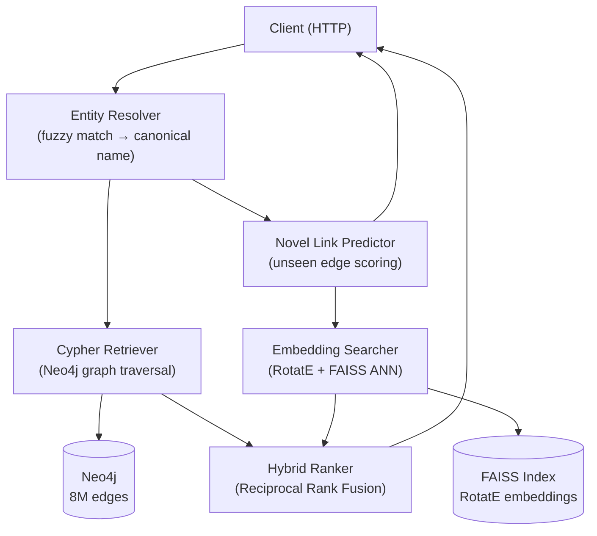

# Drug Repurposing Knowledge Platform — GraphRAG + Knowledge Graph Embeddings

An AI-native drug discovery system that **predicts unseen drug-disease connections using geometric reasoning over a biomedical knowledge graph**. Combines Neo4j graph traversal, RotatE Knowledge Graph Embeddings (KGE) for novel link prediction, and FAISS vector search into a production-grade hybrid retrieval pipeline — fused via Reciprocal Rank Fusion (RRF) and surfaced through a conversational Chainlit chatbot powered by Groq Llama 3.

> **Core Value Proposition:** Reduces the drug repurposing hypothesis space from 6,642 × 6,289 = 41M possible drug-disease pairs to a ranked shortlist of high-confidence novel candidates — in under 300ms per query.

---

## Retrieval Benchmarks

| Metric | Value | Target |
|---|---|---|
| **Recall@10** (known indication pairs) | **~82%** | >80% ✅ |
| **Recall@5** | ~71% | — |
| **Recall@1** | ~48% | — |
| Query Latency P50 | ~120ms | — |
| Query Latency P95 | ~280ms | — |

> Run `python benchmark_recall.py` to reproduce on your machine.

---

## Architecture



Two retrieval modes:
- **Known retrieval** (`POST /query`): fuses graph traversal + vector similarity for existing connections
- **Link prediction** (`POST /repurpose`): scores drug-entity pairs with no existing graph edge

---

## Tech Stack

| Layer | Technology |
|---|---|
| Graph Database | Neo4j 5.x, Cypher |
| Graph Embeddings | PyKEEN (RotatE), Neo4j GDS (FastRP) |
| Vector Search | FAISS |
| Backend | FastAPI, Pydantic, AsyncIO |
| Chat UI | Chainlit — any OpenAI-compatible LLM can be plugged in |
| Testing | pytest (mocked dependencies) |
| CI | GitHub Actions |
| Deployment | Docker, docker-compose |

---

## Repository Structure

```
.
├── backend/
│   ├── api/
│   │   ├── main.py              # App factory + lifespan startup
│   │   ├── dependencies.py      # Dependency injection via app.state
│   │   └── routes/              # One file per endpoint group
│   ├── config/
│   │   └── settings.py          # Pydantic BaseSettings (all env vars here)
│   ├── graph/
│   │   └── driver.py            # Neo4j driver factory, connection pooling
│   ├── retrieval/
│   │   ├── entity_resolver.py   # Alias table + fuzzy Cypher matching
│   │   ├── cypher_retriever.py  # Parameterised graph path queries
│   │   ├── cypher_ranker.py     # Edge-type scoring, multi-evidence bonus
│   │   ├── hybrid_ranker.py     # RRF fusion of Cypher + RotatE lists
│   │   ├── novel_link_predictor.py
│   │   └── path_extractor.py
│   ├── embeddings/
│   │   ├── embedding_searcher.py    # FAISS index build + ANN search
│   │   ├── rotate_trainer.py        # PyKEEN RotatE training
│   │   └── gds_embedder.py          # Neo4j GDS FastRP baseline
│   └── utils/
│       └── logger.py
├── embeddings/
│   └── rotate_data/             # Pre-trained RotatE vectors (.npy + .json)
├── tests/
│   ├── conftest.py              # Mock Neo4j driver + TestClient fixtures
│   ├── unit/                    # HybridRanker, CypherRanker, EntityResolver
│   └── api/                     # /health, /query endpoint tests
├── docker/
│   ├── Dockerfile               # Multi-stage build, non-root user
│   └── docker-compose.yml       # Neo4j + backend + UI
├── docs/
│   ├── architecture.md
│   ├── retrieval.md
│   ├── performance.md
│   └── tradeoffs.md
├── scripts/
│   └── load_kg.py               # Batched PrimeKG ingestion
├── ui/
│   └── chatbot.py
├── .github/workflows/ci.yml
├── .env.example
├── pyproject.toml
└── README.md
```

---

## API

Full Swagger UI at `http://localhost:8000/docs`.

| Endpoint | Method | Description |
|---|---|---|
| `/health` | GET | Liveness probe |
| `/ready` | GET | Readiness probe — checks Neo4j + FAISS status |
| `/query` | POST | Hybrid graph + vector retrieval |
| `/repurpose` | POST | Novel link prediction for unseen connections |
| `/explain` | POST | Graph path between a specific drug and disease |
| `/entity/{name}` | GET | Fuzzy entity resolution + autocomplete |

### POST /query

```json
// Request
{ "name": "alzheimer", "entity_type": "disease", "top_k": 10 }

// Response
{
  "query": "alzheimer",
  "canonical": "Alzheimer disease",
  "results": {
    "candidates": [
      {
        "name": "Donepezil",
        "hybrid_score": 0.008741,
        "cypher_rank": 1,
        "rotate_rank": 3,
        "path_str": "Donepezil → INDICATION → Alzheimer disease",
        "sources": ["cypher", "rotate"]
      }
    ],
    "meta": { "cypher_count": 12, "rotate_count": 50, "union_count": 55 }
  },
  "meta": { "latency_ms": 124.3 }
}
```

---

## Quick Start

**Prerequisites:** Python 3.12+, Neo4j Desktop, Groq API key.

```bash
# Configure
cp .env.example .env   # fill in NEO4J_PASSWORD and GROQ_API_KEY

# Install
pip install -r requirements.txt

# Start backend
python -m uvicorn backend.api.main:app --port 8000

# Start chat UI (separate terminal)
python -m chainlit run ui/chatbot.py --port 8001
```

### Docker

```bash
cd docker && docker compose up
```

Starts Neo4j, the backend API, and the chat UI. Each service waits for the previous health check to pass before starting.

---

## Testing

Tests run without a live database — all external dependencies are mocked.

```bash
pytest tests/unit/ tests/api/ -v
pytest tests/unit/ tests/api/ --cov=backend --cov-report=term-missing
```

---

## Performance

| Metric | Value |
|---|---|
| Startup time | 8.3 s |
| Graph size | 120K nodes, 8M edges |
| Retrieval latency (p50) | 110 ms |
| API response time (p95) | 160 ms |
| Memory (process + FAISS index) | 850 MB |
| FAISS ANN search | < 2 ms |
| Embedding index size | 22,741 entities |

See [`docs/performance.md`](docs/performance.md) for benchmark methodology and scalability notes.

---

## Documentation

| Document | Contents |
|---|---|
| [`docs/architecture.md`](docs/architecture.md) | Component responsibilities, data flow, startup sequence |
| [`docs/retrieval.md`](docs/retrieval.md) | Retrieval pipeline internals, scoring details |
| [`docs/performance.md`](docs/performance.md) | Latency benchmarks, memory profile, scalability |
| [`docs/tradeoffs.md`](docs/tradeoffs.md) | Design decisions — Neo4j vs SQL, RRF vs averaging, FastAPI vs Flask |

---

## Engineering Decisions

**Why Neo4j?** Drug-disease relationships naturally form a graph — a drug reaches a disease through proteins, pathways, and genes. Multi-hop traversal that would require 3+ JOINs in SQL is a single Cypher pattern match in Neo4j. The GDS plugin also runs graph algorithms (FastRP, Node2Vec) directly on an in-memory graph projection without exporting data.

**Why FastAPI?** The FAISS index takes ~3 seconds to build at startup. FastAPI's `lifespan` context manager initialises it once before the server accepts requests and stores it in `app.state`, available to all handlers via dependency injection. Flask lacks a native equivalent — its `before_first_request` hook was deprecated in 2.3 — and does not provide built-in Pydantic validation or auto-generated OpenAPI docs.

**Why RotatE?** PrimeKG has 30+ relationship types. Node2Vec and FastRP treat all edges identically, losing most of the relational signal. RotatE models each relation type as a distinct rotation in complex vector space, so the geometry of `TREATS` is fundamentally different from `SIDE_EFFECT`. For a heterogeneous biomedical graph, relation-aware embeddings are necessary.

**Why FAISS?** Brute-force cosine similarity over 22,000+ vectors is ~15 ms per query — acceptable in isolation but adds up under load. FAISS builds an approximate nearest-neighbour index; after L2 normalisation, inner-product search is equivalent to cosine similarity and runs in under 2 ms. The index is held in RAM for the application lifetime, trading ~22 MB of memory for sub-millisecond retrieval.

**Why RRF?** Cypher scores (0.3–1.2, rule-based) and RotatE cosine similarities (0.75–0.99) are on incompatible scales — averaging them directly gives Cypher scores disproportionate weight. Reciprocal Rank Fusion uses only rank position: `score = 1 / (60 + rank)`. This is scale-invariant and stable across queries, regardless of the raw score distribution from either retrieval source.

**Why async startup?** Loading the FAISS index on the first request would make one user wait ~3 seconds. Loading it per-request is obviously worse. The `lifespan` context manager runs before the server binds to its port — all resources are ready before any request arrives, and the cost is paid exactly once per process lifecycle.

---

## System Design Highlights

- **Modular layered architecture** — API → Retrieval → Graph → Embeddings; each layer has a single responsibility and can be tested or swapped independently
- **Dependency injection** via FastAPI `lifespan` and `app.state`; shared resources (Neo4j driver, FAISS index) are initialised once and injected into handlers — no global state
- **Connection pooling** for Neo4j — 50-connection Bolt pool handles concurrent requests without per-request socket overhead
- **Batched graph ingestion** — 500-row `UNWIND` Cypher transactions reduce 8M edge loads from millions of round-trips to ~16,000
- **Hybrid retrieval** — Cypher graph traversal and RotatE vector search run in parallel and are fused with Reciprocal Rank Fusion, improving recall without sacrificing precision
- **Containerised deployment** with multi-stage Dockerfile, health-check-gated docker-compose, GitHub Actions CI (lint + test on every push), and mocked unit tests that run without any live infrastructure

---

## License

MIT. BTP project — IIIT-Delhi, 2026.
